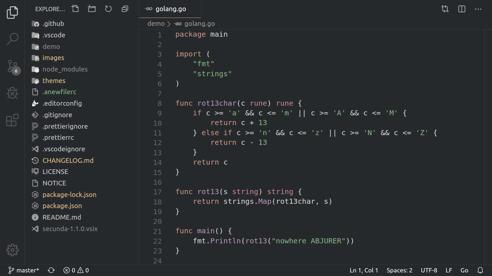

  <h1>Secunda</h1>

  
A simple dark theme for coding at night

  

  

> **NOTE**: Grayscale icons are from Material Icon Theme. Various tweaks, such as
> removing explorer badges, indent lines, etc. are applied to VS Code to achive
> the minimal layout shown in the screenshot.

## Inspiration

- [Ra Eyeful](https://github.com/rahmanyerli/ra-eyeful) by Rahman Yerli

## License

Copyright 2020 Rodger Jordas

This project is licensed under the terms of the MIT License.
